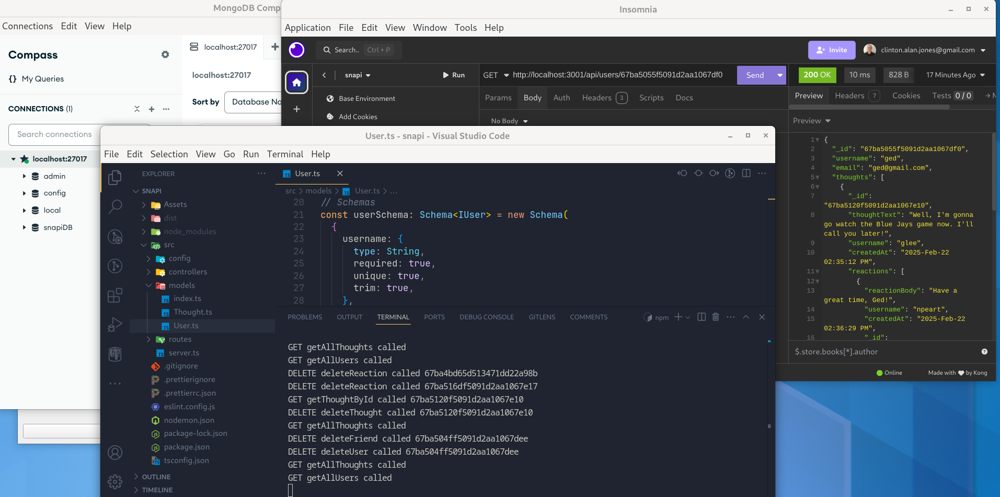

# SNAPI 

## Description

SNAPI simulates a social network web application where users can share their thoughts, react to friends' thoughts, and create a friend list. It uses Express.js for routing, a MongoDB database, the Mongoose ODM and displays timestamps using the dayjs library.  
  
   

## Table of Contents

- [Installation](#installation)
- [Usage](#usage)
- [License](#license)
- [Contributing](#contributing)
- [Tests](#tests)
- [Questions](#questions)

## Installation

1. Change the project's root directory  
2. Install the dependency modules: npm install  
3. Build: npm run build  

## Usage

1. Start the server: npm run start  
2. See the [spec](Assets/docs/spec.md) for details of the original requirements  
3. Use a RESTful API tool to send HTTP requests. For examples you can import this [Insomnia test](Assets/test/Insomnia_snapi.json) configuration  
* See the [SNAPI Walkthrough video](https://drive.google.com/file/d/1j8teRQAiBI-6NsjRoT7JDH3OOAciz6au/view)

## License

This application is covered under the [MIT](https://opensource.org/licenses/MIT) license

## Contributing

Guidelines:  
Ensure your code follows the project's coding standards.  
Write clear and concise commit messages.  
If your changes include new features, please update the documentation accordingly.  
If you are fixing a bug, please include a test to verify the fix.  
Thank you for your contributions!  

## Tests

Test instructions:  
1. Add to the existing HTTP requests in the [Insomnia test](Assets/test/Insomnia_snapi.json) configuration.  
2. Test any new CRUD routes you add and execute the existing suite. Pay particular attention to any existing routes that would be effected by your changes.

## Questions

If you have any questions, feel free to reach out: 
- GitHub: [clintsrc](https://github.com/clintsrc)  
- Email: clinton.alan.jones@gmail.com

